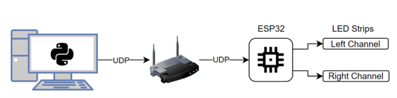
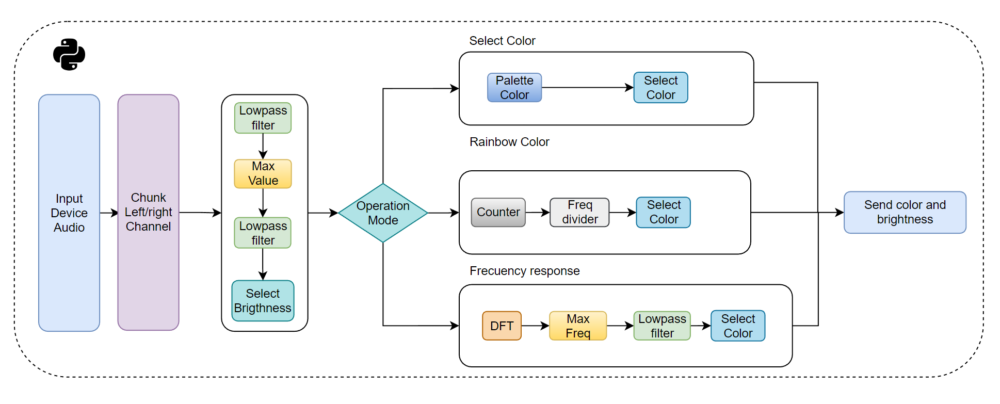
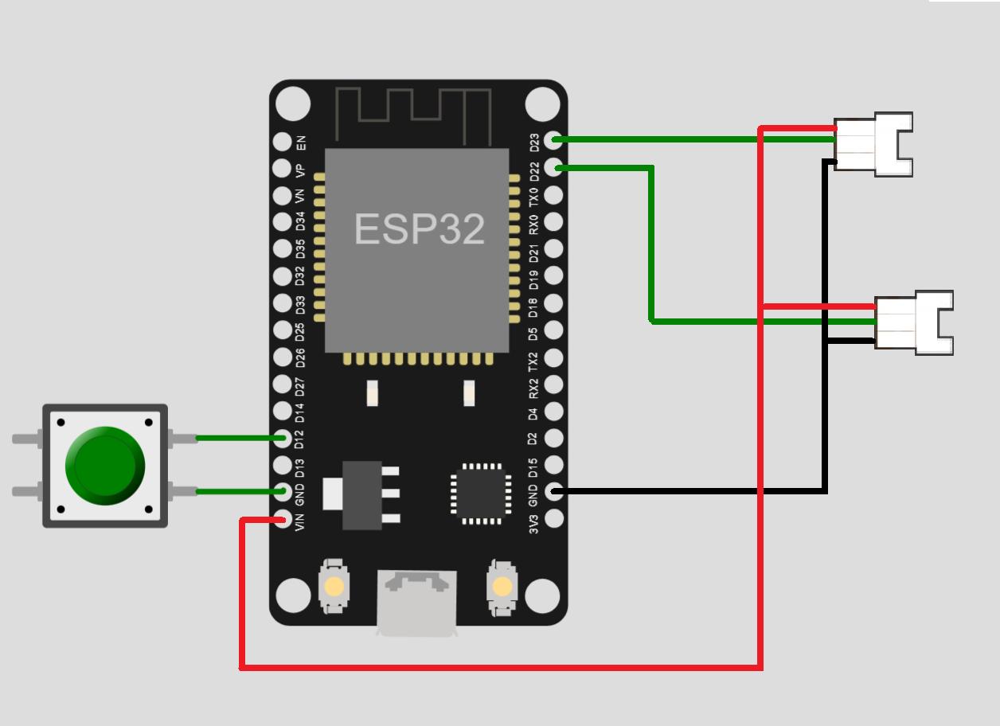
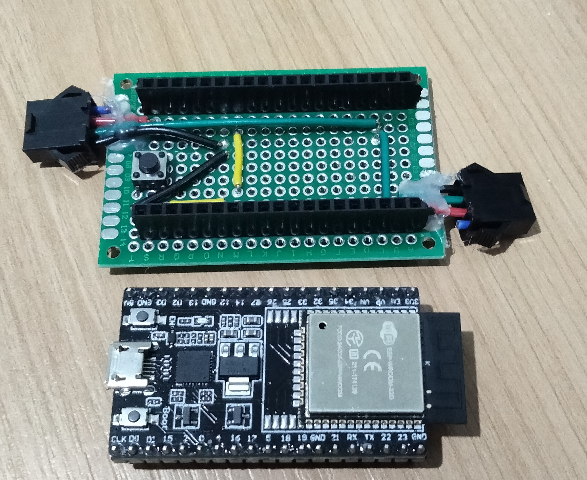
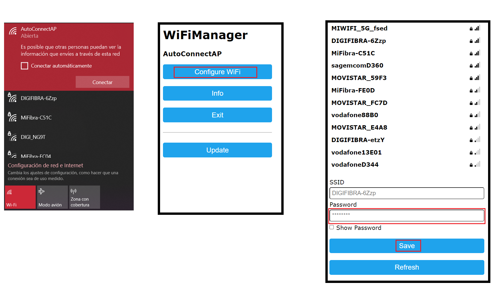
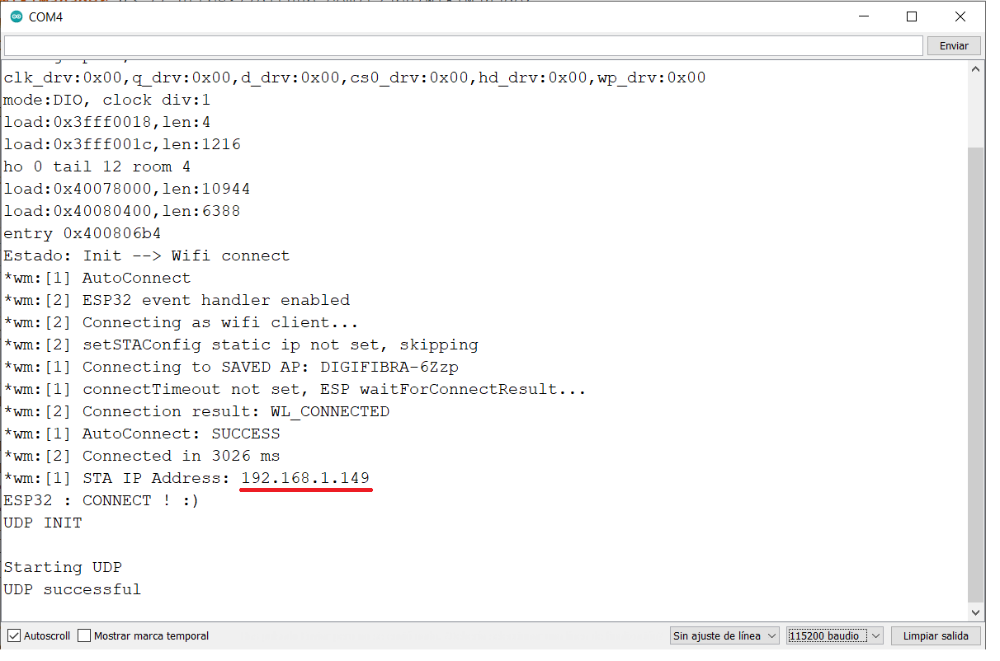
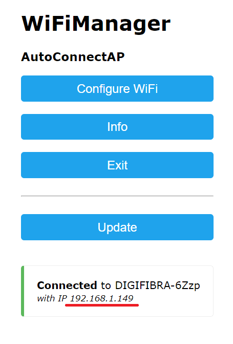
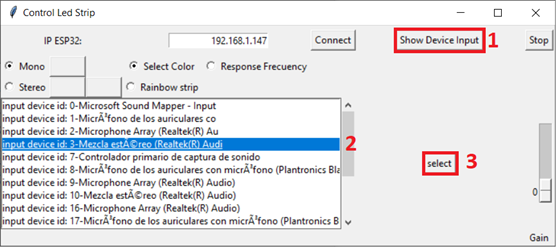

# Control Led Strip RGB sw2812B 
## Description
Hardware and software description to use Led Strip with led sw2812B (intelligent led), this repository has all the necessary to control Led Strip Music Response Wireless, using an ESP32 and UDP communication protocol.
This prototype can control two led strips independently, it is designed to respond to stereo music.

##Diagram high level
The image below shows a description of the high-level concept of the project.



###Python side
A description of the concept of python is shown below, basically, there are multiple operation modes. Select color, Rainbow Color, and Frequency response, these modules select color and brightness, and the last block sends information throw UDP protocol.



## How to install
### Hardware

The image below shows the hardware connection to be made


In my case, I used a self-developed shield to facilitate the connection, the image below shows an example of this shield. I add a specific connector to the connected led strip and to the shield.


Button allow change wi-Fi network without recompile the project and load again.
## Software
### ESP32
The code for ESP32 is in Control_led_Strip_ESP32.ino, you only need to change this code in your microcontroller. 

Important! Modify the number of LEDs and pins that you use for the led strip

```
#define NUM_LEDS_L 20    
#define NUM_LEDS_R 20    

```

Once the code is uploaded to the ESP32, an AutoConnectAP Wi-Fi network will automatically be created, the password is: password. If you can change it, modify it in the code.
The image below shows step-by-step how to connect to your Wi-Fi network, you can configure it from a PC o smartphone.

Once ESP32 is connected, the led strip turns on with red color, you can visualize IP from Monitor Serial, this IP is needed to use the python interface and control.



Alternatively you can push button and conect to ESP32 to see actual IP



### Python
To run the Python interface script, you need flowing dependencies: pyaudio, numpy, tkinter, and math.
## How to use


Once Code is uploaded in ESP32, connect the led strip and power up the device, led strip turn on with the color red.

Push the button to connect to ESP32 to create another network and visualize the actual IP Address. When you have IP, reset ESP32.

Execute Python Script and introduce ESP32’s IP, click on “connect”, led Strip change color to white, and turn off.
Click on “Show device input” and select: Mezcla stereo.


 
Python script analyze audio and send color and brightness to ESP32. Actually, I, used “Mezcla stereo” as input audio, I’m working to read the audio from the previous stage. 

To have a better performance I recommend connecting your output audio to speakers.

Move Gain control to have more brightness if the volume in your PC is low.

If you push Stop, transmission data stop and you need to connect again ESP32 and you PC, this step is useful because your ESP32 will consume low power while it is not connected.

### Operation mode
There are different operation modes
* Select color:
	* Mono: Select the color of the whole led strip 
	* Stereo: Select the color of each strip, left and right led strip
* Rainbow Strip
	* Mono: Change color like a rainbow
	* Stereo: Change color like a rainbow
* Response Frecuency:
	* Mono: Change color and brightness in function of dominant frequency 
	* Stereo: Change color and brightness in function of dominant frequency and volume of each channel.
All mode Mono analyzes audio mono, while Stereo analyzes two channels separately 

## Q& A
*I don’t have “Mezcla Stereo” audio as an input device:
It’s possible that this option is disabled by default, to enable this option go to configuration of Sound and right click to show device disable, 
 
